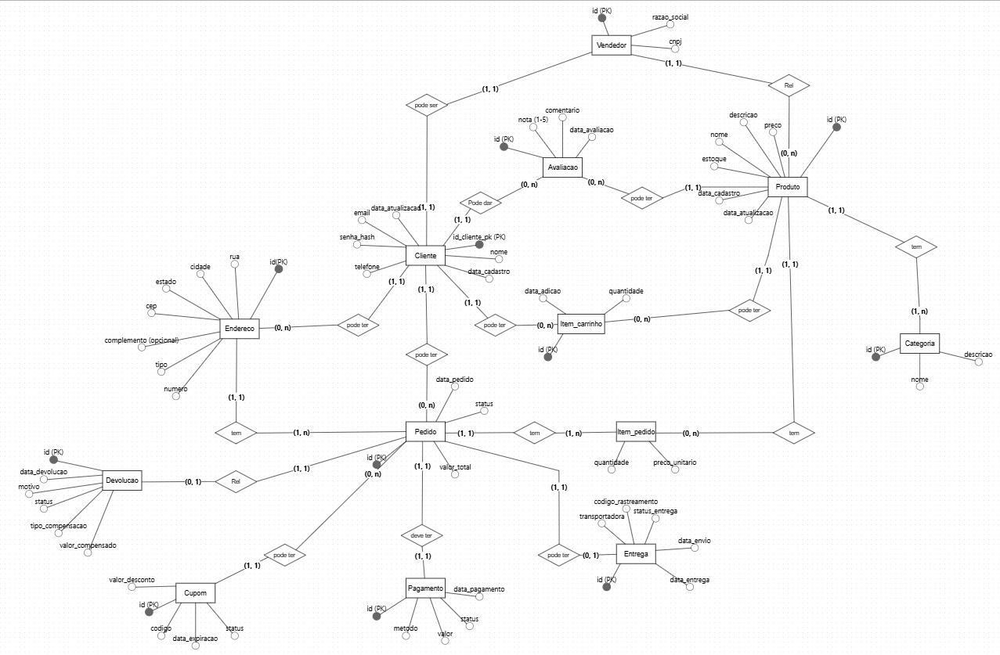
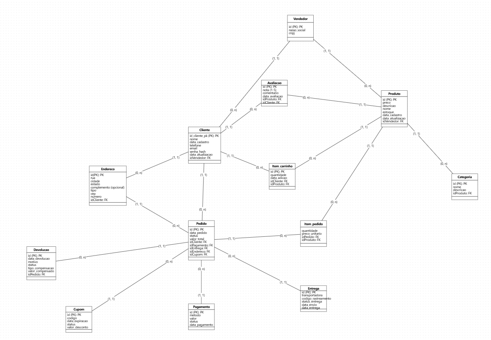

# Sistema de Gestão de Marketplace 🛒

Este repositório contém o projeto de banco de dados para uma plataforma de e-commerce integrada. O sistema foi desenhado para suportar múltiplos vendedores, gestão rigorosa de estoque, auditoria de preços e fluxo completo de pós-venda.

## 📖 Contexto e Regras de Negócio (Minimundo)

A arquitetura do sistema baseia-se nas seguintes premissas de negócio:

* **Perfil de Usuário:** O sistema adota um modelo de extensão. Todo **Vendedor** é antes um **Cliente**, precisando apenas registrar dados jurídicos adicionais para habilitar as vendas.
* **Catálogo e Estoque:** Produtos são categorizados e vinculados a um vendedor específico. O sistema garante que o estoque nunca seja negativo.
* **Integridade de Preços (Auditoria):** No momento da compra, o preço unitário é registrado no item do pedido. Isso garante que alterações futuras no preço do produto não afetem o histórico financeiro de vendas passadas.
* **Fluxo de Pedido:** Gestão de cupons de desconto, endereços de entrega e integração com transportadoras.
* **Avaliações e Devoluções:** Clientes podem avaliar cada produto uma única vez (escala de 1 a 5) e solicitar devoluções com registro de motivo e estorno.

---

## 📐 Modelagem de Dados

O projeto segue as etapas de modelagem clássica para garantir a normalização e integridade dos dados.

### 1. Modelo Conceitual
Focado nas entidades e regras de negócio de alto nível.

[🔗 Visualizar diagrama original no editor](https://app.brmodeloweb.com/#!/publicview/69a720f96431b763534360b3)

---

### 2. Modelo Lógico (Relacional)
Detalhamento das tabelas, chaves primárias (PK), chaves estrangeiras (FK) e tipos de dados compatíveis com PostgreSQL.

[🔗 Visualizar diagrama original no editor](https://app.brmodeloweb.com/#!/publicview/69a721586431b763534360d4)

---

## 🛠️ Tecnologias Utilizadas

* **SGBD:** NeonDB [PostgreSQL]
* **Ferramenta CASE:** [BrModelo Web]
  
